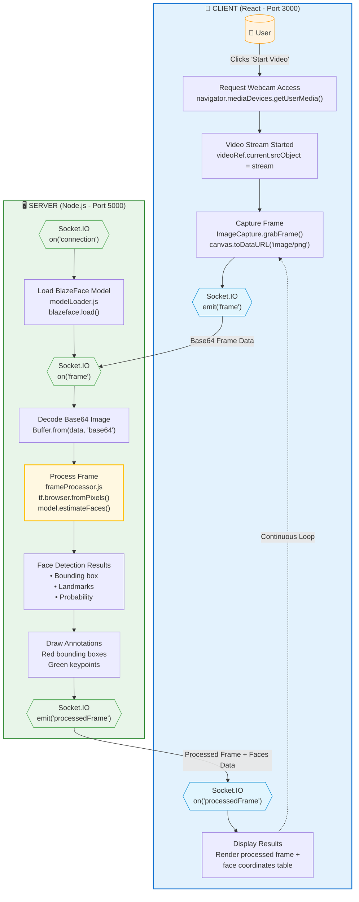
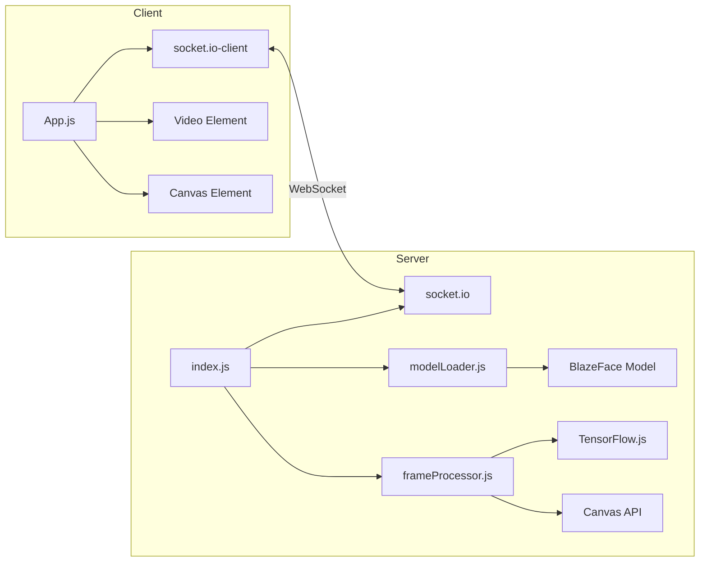
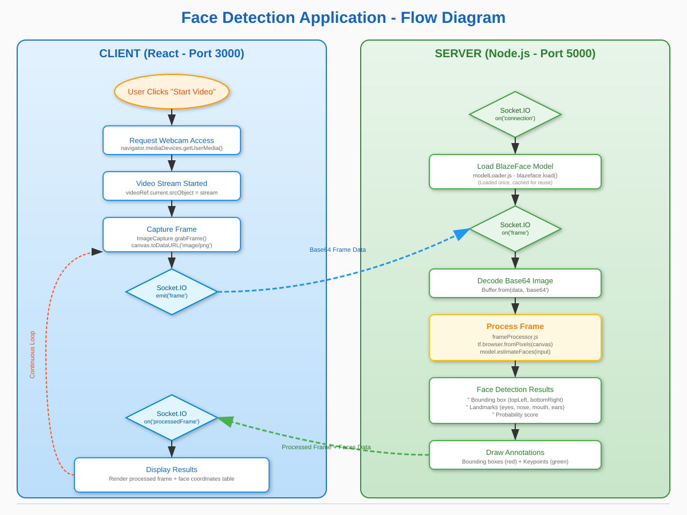

# Face Detection Application - Flow Diagram

This document describes the complete data flow of the Face Detection application.

## Architecture Overview

The application uses a **Client-Server architecture** with real-time communication via Socket.IO:

- **Client**: React application running on port 3000
- **Server**: Node.js/Express with TensorFlow.js running on port 5000

## Flow Diagram



## Detailed Flow Description

### Client-Side Flow

| Step | Component | Description |
|------|-----------|-------------|
| 1 | **User Action** | User clicks "Start Video" button |
| 2 | **Webcam Access** | Browser requests camera permission via `navigator.mediaDevices.getUserMedia()` |
| 3 | **Video Stream** | Video stream is attached to the video element |
| 4 | **Frame Capture** | Frames are captured using `ImageCapture.grabFrame()` and converted to Base64 PNG |
| 5 | **Socket Emit** | Frame data is sent to server via Socket.IO `emit('frame')` |
| 6 | **Receive Results** | Processed frame and face data received via `on('processedFrame')` |
| 7 | **Display** | Processed frame rendered on canvas, face coordinates displayed in table |

### Server-Side Flow

| Step | Component | Description |
|------|-----------|-------------|
| 1 | **Connection** | Client connects via Socket.IO |
| 2 | **Model Loading** | BlazeFace model loaded (cached after first load) |
| 3 | **Receive Frame** | Base64 frame data received via `on('frame')` |
| 4 | **Decode** | Base64 data decoded to image buffer |
| 5 | **Process** | Frame processed through TensorFlow.js and BlazeFace model |
| 6 | **Detection** | Face detection returns bounding boxes, landmarks, and probability |
| 7 | **Annotate** | Bounding boxes (red) and keypoints (green) drawn on canvas |
| 8 | **Response** | Processed frame and face data sent back to client |

## Component Diagram



## Data Structures

### Frame Data (Client → Server)
```javascript
// Base64 encoded PNG image
"data:image/png;base64,iVBORw0KGgo..."
```

### Processed Response (Server → Client)
```javascript
{
  frameDataUrl: "data:image/png;base64,...",  // Annotated image
  faces: [
    {
      topLeft: [x, y],           // Bounding box top-left corner
      bottomRight: [x, y],       // Bounding box bottom-right corner
      landmarks: {
        right_eye: [x, y],
        left_eye: [x, y],
        nose: [x, y],
        mouth: [x, y],
        right_ear: [x, y],
        left_ear: [x, y]
      },
      probability: 0.95          // Detection confidence (0-1)
    }
  ]
}
```

## Technology Stack

| Layer | Technology | Purpose |
|-------|------------|---------|
| Frontend | React | UI components and state management |
| Communication | Socket.IO | Real-time bidirectional communication |
| Backend | Express.js | HTTP server and routing |
| ML Framework | TensorFlow.js | Machine learning inference |
| Model | BlazeFace | Face detection model |
| Containerization | Docker | Deployment and isolation |

## Visual Flow Diagram

For a more detailed visual representation, see the SVG diagram:


