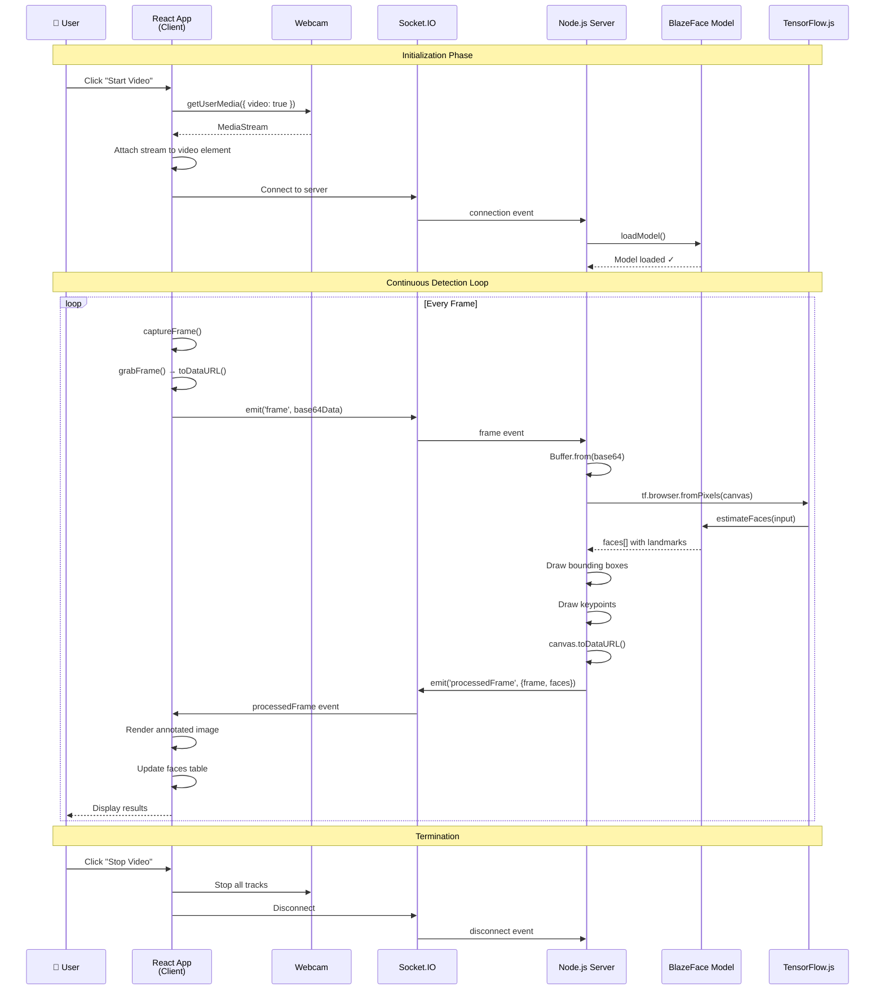
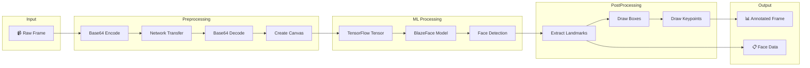
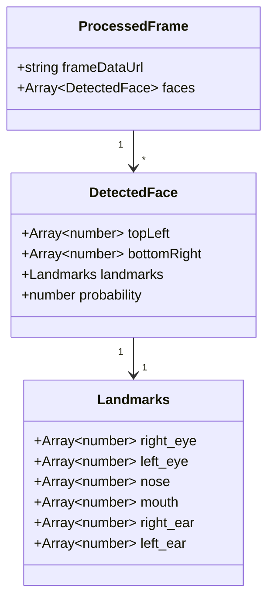
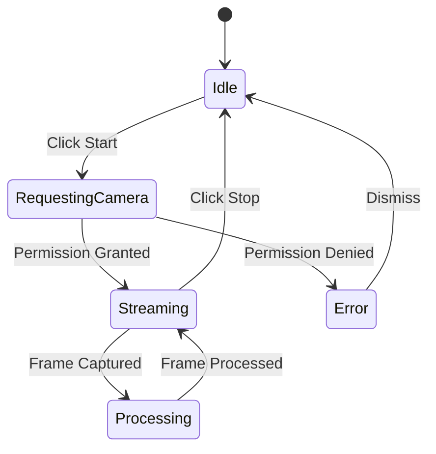

# Face Detection - Sequence Diagram

## Real-Time Face Detection Sequence

```mermaid
sequenceDiagram
    participant U as 👤 User
    participant R as React App<br/>(Client)
    participant W as Webcam
    participant S as Socket.IO
    participant N as Node.js Server
    participant M as BlazeFace Model
    participant T as TensorFlow.js

    Note over U,T: Initialization Phase
    U->>R: Click "Start Video"
    R->>W: getUserMedia({ video: true })
    W-->>R: MediaStream
    R->>R: Attach stream to video element
    R->>S: Connect to server
    S->>N: connection event
    N->>M: loadModel()
    M-->>N: Model loaded ✓

    Note over U,T: Continuous Detection Loop
    loop Every Frame
        R->>R: captureFrame()
        R->>R: grabFrame() → toDataURL()
        R->>S: emit('frame', base64Data)
        S->>N: frame event
        N->>N: Buffer.from(base64)
        N->>T: tf.browser.fromPixels(canvas)
        T->>M: estimateFaces(input)
        M-->>N: faces[] with landmarks
        N->>N: Draw bounding boxes
        N->>N: Draw keypoints
        N->>N: canvas.toDataURL()
        N->>S: emit('processedFrame', {frame, faces})
        S->>R: processedFrame event
        R->>R: Render annotated image
        R->>R: Update faces table
        R-->>U: Display results
    end

    Note over U,T: Termination
    U->>R: Click "Stop Video"
    R->>W: Stop all tracks
    R->>S: Disconnect
    S->>N: disconnect event
```

## Processing Pipeline Detail

```mermaid
flowchart LR
    subgraph Input
        A[📹 Raw Frame]
    end
    
    subgraph Preprocessing
        B[Base64 Encode]
        C[Network Transfer]
        D[Base64 Decode]
        E[Create Canvas]
    end
    
    subgraph ML["ML Processing"]
        F[TensorFlow Tensor]
        G[BlazeFace Model]
        H[Face Detection]
    end
    
    subgraph PostProcessing
        I[Extract Landmarks]
        J[Draw Boxes]
        K[Draw Keypoints]
    end
    
    subgraph Output
        L[📊 Annotated Frame]
        M[📋 Face Data]
    end
    
    A --> B --> C --> D --> E --> F --> G --> H --> I --> J --> K --> L
    I --> M
```

## Face Detection Output Structure

```mermaid
classDiagram
    class DetectedFace {
        +Array~number~ topLeft
        +Array~number~ bottomRight
        +Landmarks landmarks
        +number probability
    }
    
    class Landmarks {
        +Array~number~ right_eye
        +Array~number~ left_eye
        +Array~number~ nose
        +Array~number~ mouth
        +Array~number~ right_ear
        +Array~number~ left_ear
    }
    
    class ProcessedFrame {
        +string frameDataUrl
        +Array~DetectedFace~ faces
    }
    
    ProcessedFrame "1" --> "*" DetectedFace
    DetectedFace "1" --> "1" Landmarks
```

## State Machine

```mermaid
stateDiagram-v2
    [*] --> Idle
    Idle --> RequestingCamera: Click Start
    RequestingCamera --> Streaming: Permission Granted
    RequestingCamera --> Error: Permission Denied
    Streaming --> Processing: Frame Captured
    Processing --> Streaming: Frame Processed
    Streaming --> Idle: Click Stop
    Error --> Idle: Dismiss
```
